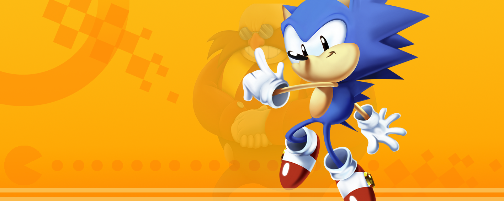

# Making a DIY Arcade
This's a recollection of when in 2023 i made a bartop style game arcade. Everything starts in 2019, when i saw a video of the channel [Leyendas de Videojuegos, where the owner made an Arcade with a custom linux os](https://www.youtube.com/watch?v=tZUfZ6DsjCk), with instructions on how to do it.
I was really inspired to do it, but my dad killed my dream when i didn't even know how to setup a linux os d:

When i entered high-school in 2023(In my country high school takes place in 5 or 6 years, because there isn't any elementary school) i wanted to make this dream idea that i had as a kid come true. So i made it happen.

# How to do it
I used an old computer and monitor i had, but you can use a Raspberry pi, preferably of at least 4gb ram.
The idea is to install a linux distro that has an emulator frontend to the pc(The one i used has EmulationStation), and from there copy all the games and rice it all you want.

If you'll buy a brand new or used computer for this project, be sure that it has good, and i mean very good, Vulkan support. Almost all emulator run better in Vulkan and Proton requires a lot of tinkering around for it to get a small percentage of what you would in Vulkan using OpenGl.

# Choosing the distro
The best thing to do is to install a Linux distro, mainly because of most emulators working better there, being less bloated for only running retro-games. The most used ones are:

- [Retropie](https://retropie.org.uk/), this one is mainly used on Raspberry Pi, but you can install the custom software in a Ubuntu machine. It was the first i decided to try, but i didn't ended up using because it doesn't have as many customization options as the others(Batocera)
Cons: Made for Raspberry Pi, i tried using it in my pc and it was prone to crashes.

- [Batocera](https://batocera.org), Batocera is a Buildroot based distro, that means that it only has the VERY basic tools needed for the job. If you don't have a very good computer it can save a lot of space to the drive and also help with the ram usage. But, that means that outside of Flathub, you can't install almost any package without re-compiling the entire os. But using Appimages for the emulators not available and Flathub you can do almost any thing. It's very customizable because it uses a modified Emulation Station that has a LOT of more options than Retropie one does.
Cons: Buildroot distro, you need to re-compile the whole os to install packages.

- [Lakka](https://www.lakka.tv/), the most lightweigh from the bunch, it only includes a Retroarch installation with the Ps3 like ui. I didn't personally try it so i can't comment that much about it.
Cons: It's basically a frontend to Retroarch with the xml ps3 like theme. If you don't like how Retroarch looks then try one of the others distros that also work with Retroarch(Retropie, Batocera)

- [Bazzite](https://bazzite.gg/)(Or any other Steam-Os like iso), this one is much newer than the other bunch, it uses similary to Steam Deck an Atomic like desktop that from the list is the one that will behave the most like a regular computer. You can use Steam Big Picture and install plugins and addons to it. But there's a big if, you will need to have decent vulkan drivers, or the Steam Big picture mode will run very slowly.
Cons: Really depends on the drivers of the pc. If you don't have good vulkan support Steam Big Picture will run slowly and Proton will require a lot of tinkering to even work(Tried installing Bazzite and Nobara in a laptop i had with bad Vulkan drivers and almost any game didn't work).

- [Windows](https://microsoft.com) I mean Windows games will run better if you don't have good vulkan drivers, and some, some, emulators will work better(Xenia maybe). Also you will have native Teknoparrot support, if you want to play arcade games. Also you can play games that use Anticheat.
Cons: Windows experience, 

I decided to use Batocera, mainly because at that time i wanted to have a simple-to-setup distro, that at the same time can be customized easily.

# Consoles
Depending on the available storage, and the specs of the machine, the consoles that you can and should install are different. It's important to firstly mark your priorities, given the available disk space you have. Would you prefer to take up around 1tb of Arcade Mame games, or would you prefer for it to be occupied by a lot of more low storage consoles, like for example Snes, nes, Master-system and Megadrive. You could also install more modern console games, for example Wii, Gamecube, Ps2, Ps3, Xbox 360, but you would need a much better pc specs and 
I tried to take a middle point, of the half a tb i had, i spent around 200gb in Mame games, around 120gb in retro consoles, and the rest divided in Windows games and more modern console games(Wii, 

# Windows games
I also added, Windows games using Proton and Lutris(I mainly used Proton for everything), all the games worked out of the box, but some, Enter the Gungeon, Forager, Super Meat Boy and Shovel Knight Shovel of Hope didn't work or recognize the controls. Mugen and Ikemen Go games worked perfectly but some needed to set the controls manually.
Some windows games i recommend are:
- [Cuphead](https://store.steampowered.com/app/268910/Cuphead/)
- [All Shovel Knight](https://store.steampowered.com/franchise/ShovelKnight)
- [Puyo Puyo Champions](https://store.steampowered.com/app/971620/Puyo_Puyo_Champions/)(No Puyo Puyo Tetris due to fking Denuvo)
- [Rivals of Aether](https://store.steampowered.com/app/383980/Rivals_of_Aether/)
- [The Binding of Isaac](https://store.steampowered.com/app/250900/The_Binding_of_Isaac_Rebirth/)
- [Ultimate Marvel vs Capcom 3](https://store.steampowered.com/app/357190/ULTIMATE_MARVEL_VS_CAPCOM_3/)
- [Forager(Go play Forager, it's incredible)](https://store.steampowered.com/app/751780/Forager/)
- [SuperMeatBoy](https://store.steampowered.com/app/40800/Super_Meat_Boy/)
Also here're some Ikemen Go and Mugen games:
- [Famicon Fighters](https://mcjimmy.net/famicomfighters.html)
- Mortal Kombat Project/Solano Edition
# Native Linux games
Most of the games work out of the box by installing them by flatpak or using a Appimage, but in some cases the game won't load the libraries property, for that you would need to install manually the .so file and specify it to .sh file that loads the game. Another option would be to install them via Flatpak.
I installed the following native games:
- [Celeste](https://store.steampowered.com/app/504230/Celeste/)
- [Sonic Mania Decompilation](https://flathub.org/apps/io.github.santiagocezar.maniatic-launcher)
- [Sonic Robo Blast 2](https://flathub.org/apps/org.srb2.SRB2)
- [Sonic 3 Air](https://flathub.org/apps/org.sonic3air.Sonic3AIR)
- [Sonic Robo Blast Racing](https://flathub.org/apps/org.srb2.SRB2Kart)
- [Here's the official documentation](https://wiki.batocera.org/systems:windows)

# Making(and Designing) the case

I wanted to do a more vibrant style for this project, so i was inspired by the old arcade drawing from Donkey Kong to design it. My dad later helped me with adapting the design to the wood guidelines we would need later.
I had custom vinyls made for the design, cutting the wood with my dad's woodcutter.

To be honest, it doesn't have a arcady retro style, when i made it i wanted it to have a more modern design, with the old Donkey Kong design. If i had to re-do it, i would maybe change the design for it to be more retro and similar to old arcades, although i don't dislike the current one.

# Final result

