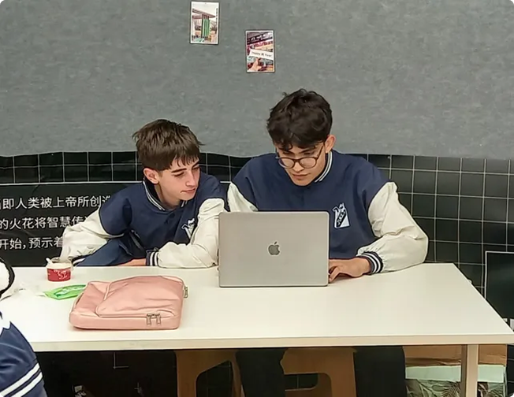
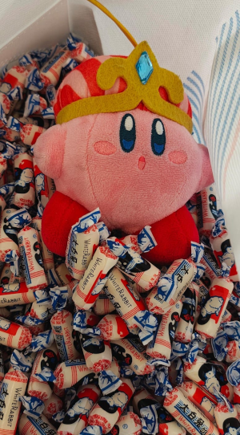

# Going to Shangai with Hackclub

I just got back from Shanghai, participating in a recent Hackclub gamejam event. It's undeniable that i learn a lot from it, the experience of going to Shanghai and meeting some of the best people i ever knew. There i realized a lot of things i would have never come up before.

# My experience
This was definitely a wild ride, i still see it as crazy that Hackclub can make these kind of events, with persons all around the world traveling. Because it's not just about the things you learn that you can use for programming, or any other subjects. It's also about the personal experience of going to Shangai being 15 years old and meeting people that share your interests from everywhere in the world, having never visited before a country outside South America. That's the crazy part i see about it, i mean, i have never visited Europe or North America, and with one trip i gave a spin around the world.

Something i learn from this, is that there will always be opportunities for you to take, never give up. The path of success is not a linear one, that's pretty clear to me from this. It may be Hackclub, stem competitions(I got first place at national level last year d: ), or maybe none of them, that's for you to decide :D. I hope my experience shows people that there'll always be chances like these to learn.

After everyone in my school realized i was going to Shanghai, they all were inspired enough to start participating in other competitions, is there something better than that? Inspiring your friends and people around you? And giving them the chance to start maybe another life?

# The idea
When i was 6 years old my dads let me had let me use the computer some days, and from that free time, i tried Undertale. That game inspired me to develop games and delve into programming in the future.

Fast forwarding a little bit into the future, when i was 9 years old an idea about a videogame came into my mind. A 2d platformer game, with very fast movement where the player had to finish levels within a timeframe. The name i had for it was SPEEDRUNNERS, very cliché, i know. I mean i just had discovered speedruns exist. 

I wanted to make the game, yet i knew at that time i didn't know how code propertly the physics of the game.
At ends of last year i started playing Celeste(I'm now at chapter 9 after completing the b-sides) and was fascinated by it. A momentum based character that felt that good to play? WHAT? The thoughts of making that forsaken game came back into my head. I even started making a prototype for it in a C++ framework.
From that idea, i also though, why isn't there any 2D platformer with similar movement to Ultrakill? And those two ideas crashed up in my head. A 2d platformer based on the momentum movement from Celeste, and the fast paced movement from Ultrakill? With short yet difficult levels that had a time limit within them?

And all of that came back this summer(Winter if ur in the us), when i was in vacations in Brazil when i checked my email. And i saw the Juice event. And to say it took my attention would be short of an understatement. I immediately there started to make the project come true to light.

# The game

It was a total Success, developed in Godot Engine, it ended up third place in the White Rabbit nominations there, and what were White Rabbit nominations? Every participant choose their favorite games, ending up in third place from all the voting done.

# What did i learn?
It's thought that with a single project you can't really go that far. Yet most people fail to realize that's not actually true, with a single videogame i went to Shangai with a Hackclub stipend and a UNR one(Argentinian Rosario Universities), gotten into multiple interviews with argentinian media, met around 86 persons from all around the world and gotten a stipend for both Steam releases and Google Play ones(Sadly no apple :d). And that, with just one videogame.
After this, i realized, hey maybe i should participate in more Hackclub events, and that's what i'm gonna do.
I learn also how to code in Godot and Gdscript, yeah, it's not that difficult, but i see myself being able to apply what i learn here in Object Oriented programming mainly in other C++ projects. Also, i learnt how to use Aseprite correctly, the bases of pixelart, and made my first project that I had to do sound design for the first time.

# Thanks

I want to specially thank everyone in Hackclub and AdventureX that made this event possible. Specially Thomas and Tongyu, that both organized the event. Cosmin, that made another side project named jungle, where you could get credits to invert in programming tools and assets(From here i got the Google Play Developer license, Aseprite, lots of fonts, and sound assets for future use). Lopa and Rushmore, who reviewed hours. And the people from AdventureX that helped Hackclub staff with safety and setting up the venue.

# So, what's next?

In my travel i met Zach, the founder of Hackclub. He's amazing! But aside from meeting him, he had a brilliant talk about the idea that Hackclub is about:

"I think the lesson of Hack Club is maybe the only thing that is holding things back from being this way is because you haven't done something about it."

That's why, i'll start a programming Club based on hackclub.com/clubs on my high school.
And who knows, maybe you can also start your own.

To be honest, in argentina not that many students in high school care about programming or computer science. Nobody knew what even Hackclub was, heck, there isn't even High School Clubs here.

At first i though, that i wouldn't be able to go further from this, i mean i went to Shangai, what else do i want. But then i got the idea of making a Hackclub programming club here, it would be one of the first ones in the country, and definitely the first in the city. 

This was really a wild ride, i still find it crazy that Hackclub can make these events, with persons all around the world travelling. But i guess i need to exploit the bug as much as i can.

Juanes out -- Written Wed May 21
